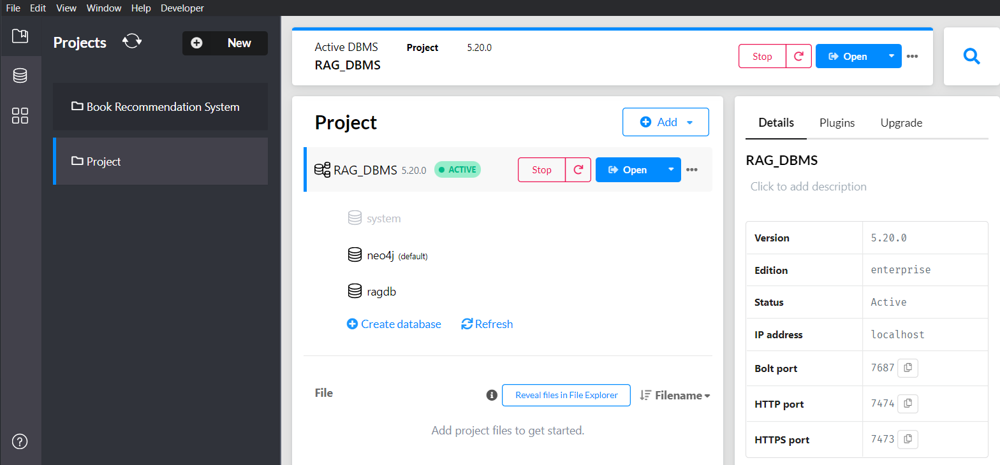

Generated a Neo4j RAG system with using LangGraph

Here the user provided Text database will be used to generate a RAG system.

Here User will have the full freedom, the user can upload any type of .txt file to do so.

I have deveoped this application to specifically leverage the system of Graph Database in a RAG application to easily and smartly enhance its power to reveal complex realtionship in database which is usually difficult to be extract by vector database.

Here all the tasks will be handled by the AI agent it self

# Installation guide:

### The neo4j desktop setup

Download the neo4j desktop from the URL:

Then install it

After that open it:



Just open the Project tab at the top left corner. Then create a new project, name it whatever you want. Then start it, by clicking on the start button.

After that go to the plugins tab as shown in the right hand side side bar along side the Details and Upgrade(you just need to click the project you will be able to open this side bar).

Now install the plugin APOC.

Set up your environment then, just create a `.env` file the paste the content from `.env.example` to this file. Provide the respective API keys like as mentioned:

The Gemini API key

The Tavily API key

And the Neo4j setup. The default password here will be "password" and username will be "neo4j"(both are without quotes here are represented so everyone will have the clear vsion).

Now, you are ready for python code installation setup.

I have used python version 3.12 to implement this code.

So first I have created a virtual environment

Then

```bash
git clone repo-url

cd neo4j_graph_langgraph_rag

python -m venv graphenv

graphenv/Scripts/activate

pip install -r requirements.txt

streamlit run app.py
```

All the best!
